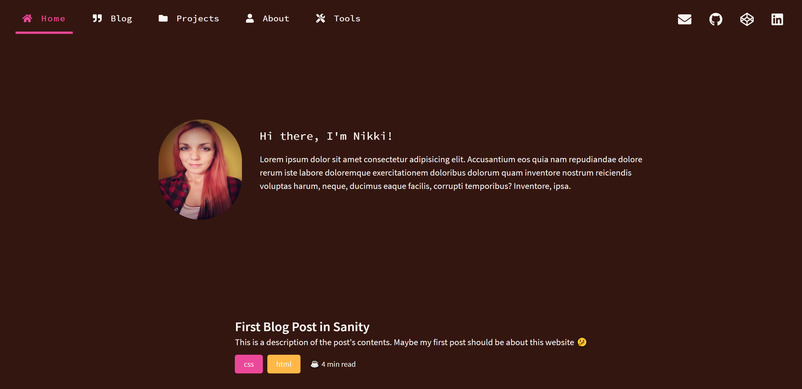
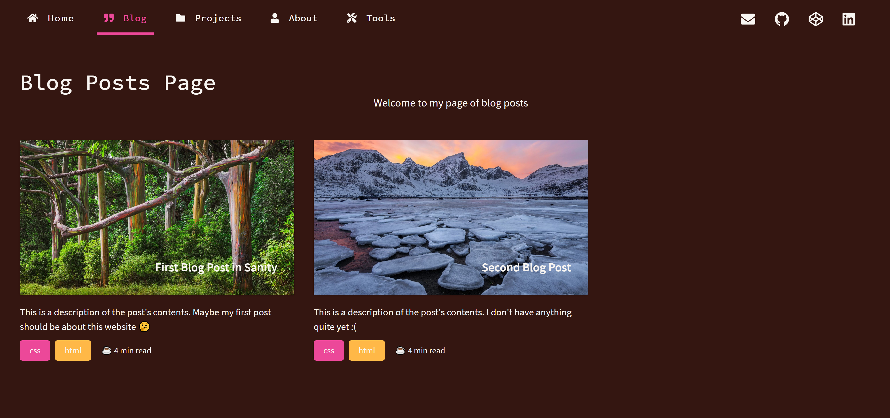
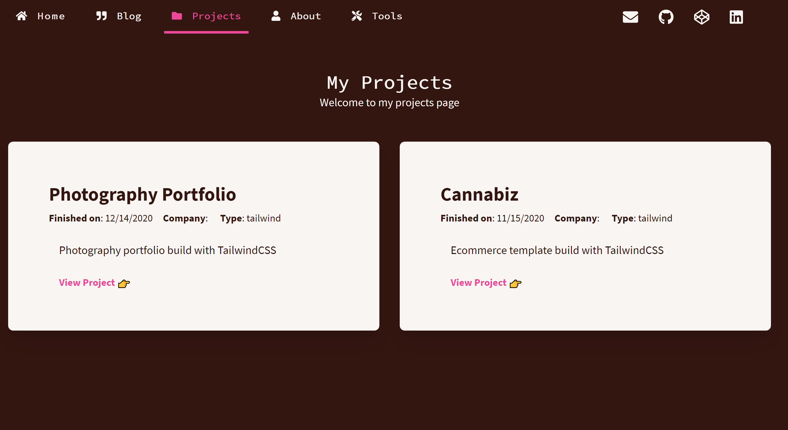
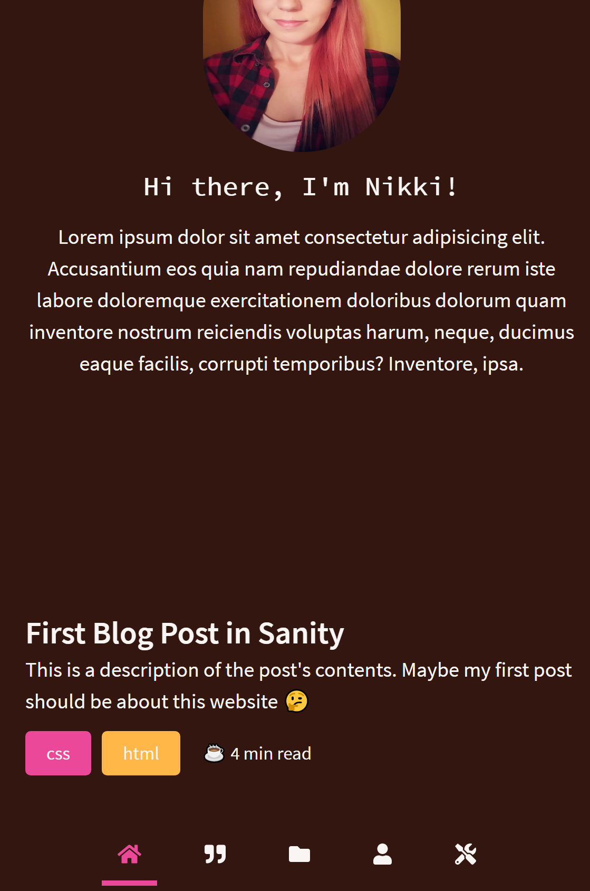

<h1>🛠 Technical Blog with React, Tailwind, and Sanity.io</h1>
*deployed with Netlify*
  

[Visit Site](https://nikkipeel.netlify.app)
 

:gem: **Features:**
- Custom color theme
- Fixed bottom navigation on mobile screens
- Additional schema added to Sanity studio for displaying code blocks in posts

### Home Page &darr;

 

### Blog Page &darr;

 

### Single Post &darr;

 

### Recent Projects &darr;

 

### Mobile Navigation &darr;

 
